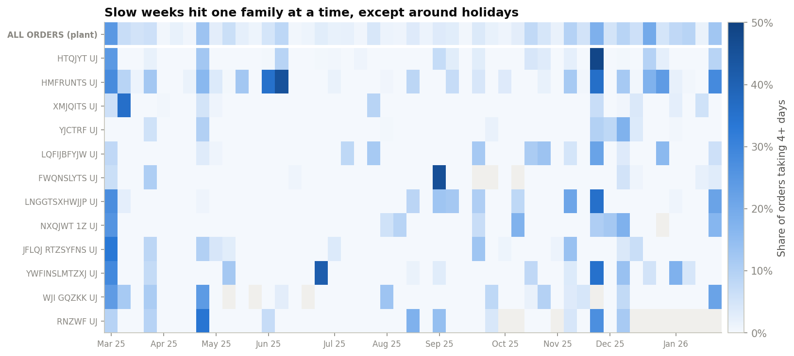
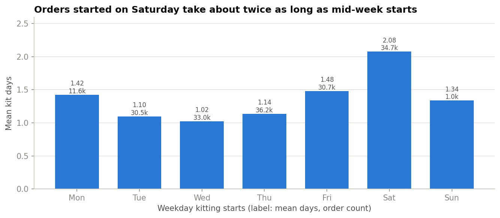
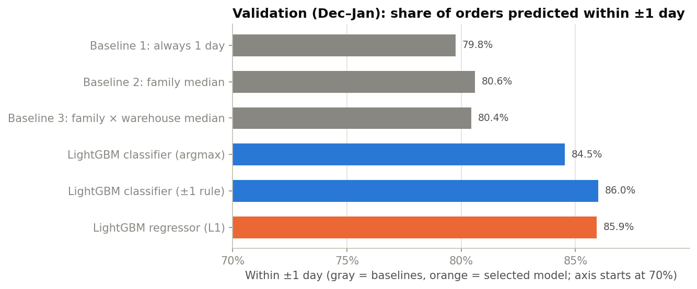
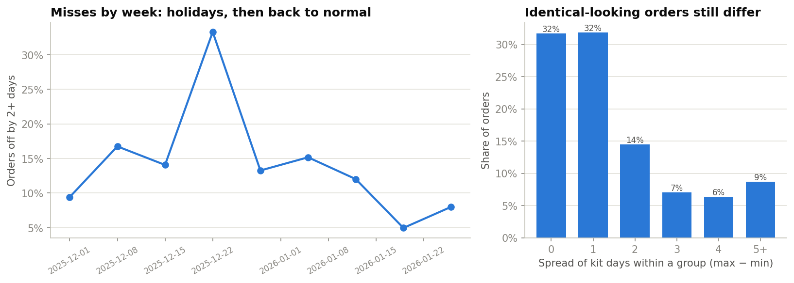

# Predicting Kit End Dates: Dell Data Science Case Study

Zakir Patwa · 2026

I built a model that predicts when kitting will finish for 12,069 upcoming orders (kit starts Feb 3 – Mar 7, 2026). It learns from about 178,000 past orders. On the most recent two months of history, which the model never saw during training, it gets **86.1%** of orders within a day of the real finish date. The best simple rule gets 80.6%. The model also gives every order a risk score, and the orders it flags as risky turn out to be slow about 3 times as often as a random pick.

The bigger finding is *why* the remaining errors happen. Slowdowns tend to hit one product family at a time, for a week or so, while the rest of the plant runs normally. That looks a lot like a part shortage, but the data doesn't record part availability or warehouse space. Tracking those two things would help more than any change to the model.

| File | What it is |
|---|---|
| [`Zakir_Patwa_DS_Case_Notebook_2026.ipynb`](Zakir_Patwa_DS_Case_Notebook_2026.ipynb) | The full analysis: framing, assumptions, exploration, cleaning, features, modeling and predictions |
| `Zakir_Patwa_DS_Case_Predictions_2026.npy` | 12,069 predicted `kit_end` dates (`datetime64[D]`), in the same row order as `inference.parquet` |
| [`figures/`](figures/) | Every chart from the notebook |
| `Zakir_Patwa_DS_Case_Predictions_2026.csv` | Created when you run the notebook, but not committed because it contains order IDs. One row per order with the predicted end date, risk score and a high-risk flag, so a planner can open it in Excel |

---

## 1. How I framed the problem

| Decision | What I chose | Why |
|---|---|---|
| What to predict | The number of calendar days kitting takes, then add it to `kit_start` | Every inference order already has a start date, so the duration is the only unknown. A "1 day" pattern also carries over from month to month, while raw dates never repeat |
| Model | I built two LightGBM models, one that picks a bucket (0, 1, 2, 3 or 4+ days) and one that predicts a number, and kept the better one | The number-predicting model won. It's trained to minimize the average number of days it's off. The bucket model is still used for the risk score |
| How I tested it | Trained on Mar–Nov 2025, tested on Dec 2025 – Jan 2026 | The real job is predicting future orders, so the test should be on later months too. A random split would let the model learn from days right next to the ones it's tested on |
| What it has to beat | Always guess 1 day · the typical time for each product family · the typical time for each family at each warehouse | If a model can't beat a rule a planner could run in a spreadsheet, it isn't worth using |
| How I scored it | Mainly **% of orders within 1 day**, plus exact-day %, average days off, and macro-F1. For the risk score: log loss, calibration and precision/recall | Being within a day is what a planner can actually schedule around. The probability checks show whether the risk score can be trusted |

I picked the model settings using a separate split (train Mar–Oct, check on November), so the Dec–Jan test months were never used to tune anything. All scores use the real kit days.

---

## 2. What slows kitting down

Before modeling, I started from how kitting works in practice. It should be fast when the parts are in stock, the warehouse has room, and people are on the floor to do the work. If any of those break, it slows down. I tested each idea with the closest data available.

| Idea | Result | What the data showed |
|---|---|---|
| H1. Part supply | Supported, indirectly | Some product families run long far more often than others (0% to 66.5% of orders taking 4+ days, among families with 200+ orders). The slowdowns come in bursts: 83 weeks where a single family ran much slower than the rest of the plant account for 31% of all slow orders |
| H2. Work schedules | Supported | Orders started on a Saturday average 2.08 days, versus 1.02 for Wednesday starts, because Sundays are rarely worked. A holiday within 3 days of the start doubles the share of slow orders (10.4% vs 4.8%). I couldn't isolate overtime, since 83% of days have some |
| H3. Warehouse congestion | Can't tell | Warehouse 3JU looks slower than KHO (1.58 vs 1.28 days), but for the same products the gap disappears. 3JU just handles slower products. There's no data on space or how full a warehouse is |



*Each row is a high-volume product family and each column is a week. Darker means more orders took 4+ days. A vertical stripe means the whole plant slowed down, usually around a holiday. A dark cell on its own means one family slowed down while everything else was normal, which is what a part shortage would look like.*



---

## 3. Problems in the data and what I did about them

| Issue | Rows | What I did |
|---|---|---|
| `kit_end` is before `kit_start` | 734 train | Dropped them. 712 fall on just three start dates (562 of the 1,265 orders on 2025-07-08 alone), which suggests the start dates were overwritten in a batch. The real start date can't be recovered |
| The file only includes orders that finished on or after 2025-03-10 | 1,392 train | Dropped orders that started before 2025-03-10. The quick ones from those days had already finished and been cut, so only slow ones were left (78–100% slow). Keeping them made early March look like a crisis and made one warehouse look slow |
| Numbers stored as text | all | Converted to numbers |
| `est_ship_date` of 1900-01-01 | 28 train / 1 inference | Treated as missing, with a flag |
| `order_amt` of $0 | 2,049 train / 100 inference | Treated as missing, with a flag, since a free hardware order isn't realistic |
| `capacity` has each date repeated hundreds of times | 191,934 → 317 dates | Kept one row per date. Dates missing from the table (Sundays, holidays and a Feb 6–7, 2026 shutdown) are treated as non-working days |
| `expected_minutes` only covers 166 of 360 families | ~25% of train / ~20% of inference rows | Filled gaps with the business-line median, then the overall median, and added a flag showing where the number came from |
| 10 order + family pairs appear twice | 20 rows | Kept them. Each pair has a different line number and quantity, so they're separate lines of the same order, not copies |

After cleaning, training went from 179,853 to 177,727 rows (−1.2%). All 12,069 inference rows were kept in their original order, and the notebook checks this. Every assumption I made is listed in the notebook's Assumptions log.

**Avoiding leakage.** "Leakage" is when a model accidentally sees information it wouldn't have in real life. Two things I did to prevent it:
- Features like "this family's average kit time" are learned only from the training months, and each training row's value is calculated without its own outcome.
- I removed the estimated ship date as an input. If Dell updates it after kitting starts, it would give away the answer. Removing it only cost 0.4 points of accuracy.

---

## 4. Results

Test set: 33,377 orders that started kitting between Dec 1, 2025 and Jan 31, 2026.

| Model | Within 1 day | Exact day | Avg. days off | Macro-F1 |
|---|---|---|---|---|
| Always guess 1 day | 79.8% | 46.9% | 0.918 | 0.128 |
| Typical time per family | 80.6% | 45.8% | 0.909 | 0.159 |
| Typical time per family + warehouse | 80.4% | 45.4% | 0.915 | 0.161 |
| LightGBM bucket model | 85.8% | 48.3% | 0.812 | 0.197 |
| **LightGBM number model (selected)** | **86.1%** | **51.5%** | **0.780** | **0.249** |



- The model beats the best simple rule by 5.5 points on being within a day, and its average miss is 14% smaller.
- The family rules barely beat "always 1 day", because almost every family's typical time is 1 day. What separates families is how often they run long, and the model picks that up.
- The two LightGBM models are effectively tied on the main score. I re-ran the comparison 2,000 times on random sets of days, and the gap ranged from −2.4 to +1.4 points. I chose the number model because its average miss is smaller.
- The model leans about equally on schedule (whether the next day is a working day, weekday, fiscal week, overtime) and on product. Warehouse barely matters (0.7%).
- **Limitation:** the model mostly predicts 1 or 2 days and rarely predicts 4+. Nothing in the data reliably says ahead of time which order will run long. That's what the risk score is for.

**Risk score.** This is the model's estimate of the chance an order takes 4+ days. Its probabilities are 11.7% better than just using historical averages (measured by log loss). On the test months, flagging the riskiest ~10% of orders caught 37% of the slow ones, and a quarter of the flagged orders really were slow. That's 3 times better than picking at random. The percentages run low, though: it predicted 5.0% slow on average when the real rate was 8.4%. So I'd use it to rank orders, not quote it as an exact chance. For the upcoming orders, the flag marks the riskiest 10%.

---

## 5. Why the model still misses



- **Slow orders cause most of the error.** Orders taking 4+ days are 8.4% of orders but 40% of the total error. When the model is off by 2+ days, 93% of the time the order took longer than predicted, not shorter.
- **Misses cluster by product and week.** 40 family-weeks, holding 8.5% of orders, contain 38% of all misses. It's the same burst pattern from H1.
- **Orders that look identical still finish at different times.** Take orders with the same product family, warehouse and start date. Everything the data records about them is the same, yet a third of the variation in kit time happens inside those groups, and 22% of them are in a group whose finish times span 3+ days. Whatever causes that isn't in the data.
- **There's a ceiling.** Even a model that somehow knew each group's actual typical outcome would only get 93.4% within a day, compared with 86.2% for my model on those orders. Getting closer would take information these tables don't have.

---

## 6. Recommendations

1. **Record part availability for each order.** For example, whether any component was short or backordered when kitting started. This targets the biggest source of error: slowdowns that hit one product family at a time (31% of slow orders, and 38% of the model's misses). Right now those can only be explained after the fact. With a shortage flag, planners and the model could see them coming.

2. **Record daily warehouse capacity and occupancy**, such as staging space used, kits in progress and headcount per shift. Right now I can't test whether congestion matters. Warehouses 3JU and 3JHF miss about 22% of orders versus about 10% at KHO, but the data can't say whether that's space, staffing or product mix.

3. **Use the risk score to prioritize each day's orders.** Give planners the top 10% riskiest orders (the `high_risk_flag` column in the planner CSV). On the test months, that list caught 37% of slow orders and was 3 times richer in them than a random pick. It's a small enough list to act on: expedite, check parts, or warn the customer early.

4. **Plan around the calendar.** Orders that start on a Saturday or right before a shutdown take about an extra calendar day (Saturday starts averaged 2.08 days versus 1.02 on Wednesday). When a ship date is tight, avoid starting kits right before a non-working day, or build the extra day into the promise date. The Feb 6–7, 2026 shutdown affects 1,442 of the upcoming orders.

5. **Fix three data-capture issues:**
   - Start dates getting overwritten for batches of orders (734 orders "finished" before they started).
   - The extract being filtered on end date, which skews the earliest weeks.
   - No record of when `est_ship_date` changes. That would show whether it's safe to use as an input. I left it out to be safe.

---

## 7. Next steps with more time

- **Recalibrate the risk score** on recent months, so its percentages can be read as real chances and not just a ranking.
- **Predict a range instead of a single day**, like "1–3 days, 80% likely", so planners can see the uncertainty.
- **Add "recent slowness" features**, such as how slow a family has been in the past week, so the model can notice a shortage that's already underway. I'd also retrain monthly and track accuracy by family.
- **Test on more than one time window** to make sure the results hold beyond Dec–Jan.
- **Confirm two things with Dell:** when `est_ship_date` gets set, and whether the inference file includes every order.

---

## 8. Limitations and assumptions

- **Long-running orders are still hard to predict.** The model is built for the typical order. Slow orders get flagged by the risk score but not predicted exactly.
- **The risk percentages run low**, because the training months had fewer slow orders than recent ones. Use the score as a ranking.
- **The test months include holidays, and the upcoming months don't.** Real accuracy may be a bit better than the test score, but that can't be confirmed without the true dates.
- **The inference file may be a sample.** It has about 431 orders per day versus 626 in training, so I didn't use daily order volume as an input. Overwritten start dates like the ones in training can't be detected in the inference file.
- I assumed the calendar (tagged site `FCJ`) applies to the order site `KHO`, and that overtime is planned ahead of time. Product names are masked in the source data.

---

## Reproducing the results

```bash
python3.9 -m venv .venv && source .venv/bin/activate
pip install -r requirements.txt
brew install libomp          # macOS only: LightGBM needs OpenMP
# Put the five .parquet files in Data/ (not included in this repo)
jupyter nbconvert --to notebook --execute --inplace Zakir_Patwa_DS_Case_Notebook_2026.ipynb
```

A full run takes about 2–3 minutes and regenerates the predictions and every chart. Results are the same every time (fixed random seed).
